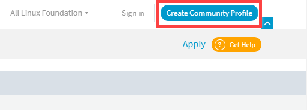

When you log in for the first time to any Linux Foundation managed service that is protected with Single Sign On (SSO),  you must create an account. To create an LF account follow these steps:

1. Navigate to LFX Platform and click Create Community Profile from top right corner of the page.

2. You can also create account from Sign In page. Click Create an Account on Sign in page.

3. On Create Your LF Account page, enter your first name, last name, email address, username, password, and click on Create Account CTA button.

